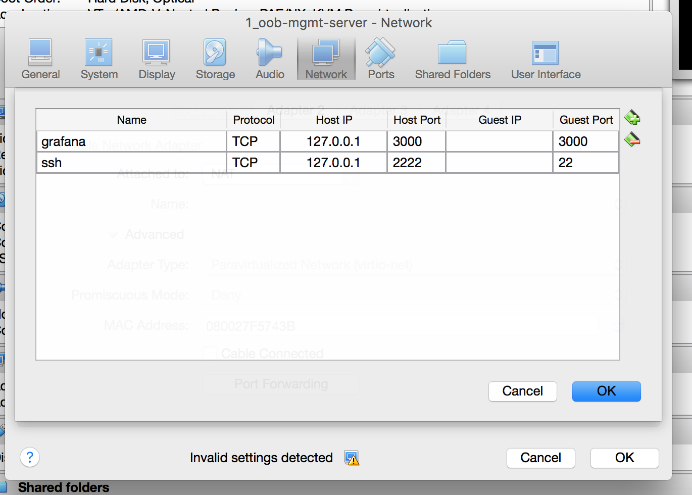
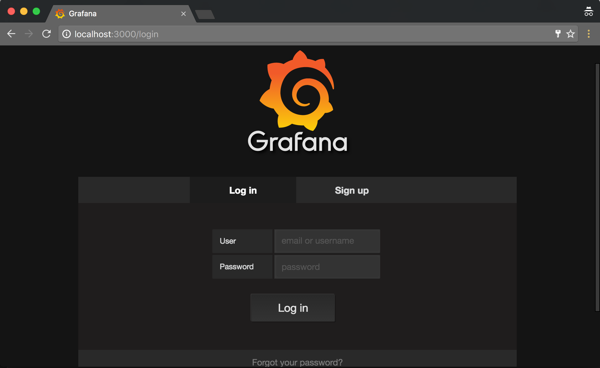
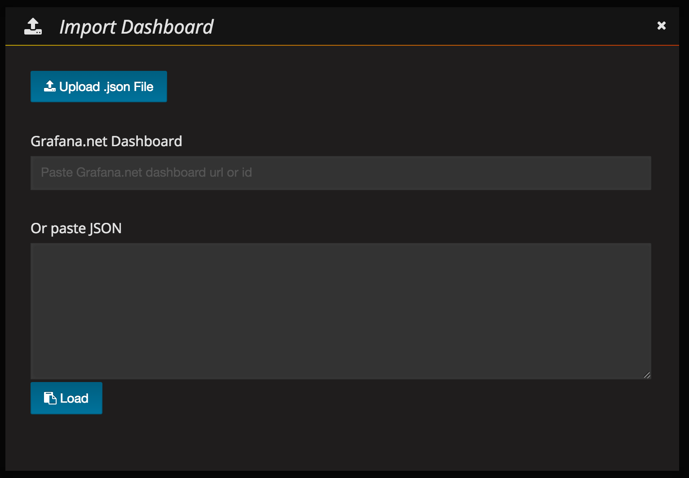
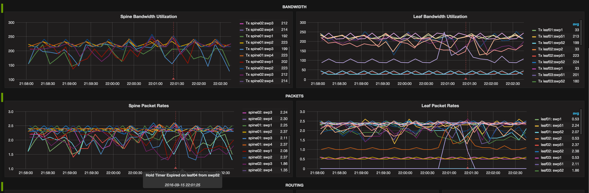

# **This directory contains an Ansible playbook that will deploy a alerting, telemetry and correlation monitoring solution.**

## CONTRIBUTING

1. Fork it.
2. Create your feature branch (`git checkout -b my-new-feature`).
3. Commit your changes (`git commit -am 'Add some feature'`).
4. Push to the branch (`git push origin my-new-feature`).
5. Create new Pull Request.

Overview
--------

This demo leverages the Cumulus [reference topology](https://github.com/cumulusnetworks/cldemo-vagrant). In order to use this demo, follow these high level steps:

1. install Vagrant and Virtualbox/Libvirt on the host
2. Clone the reference topology
3. Launch the reference topology using vagrant
4. SSH into the oob-mgmt-server
5. Clone the [monitoring-project repo](https://github.com/CumulusNetworks/monitoring-project)
6. Run the demo using main.yml

This demo requires the network to be provisioned. Without the networking being provisioned, it will not provide reliable output.

## Tools and Terminology
------------------------
Telegraf - An agent that runs on the switches that exports data to InfluxDB
InfluxDB - A timeseries database that stores the data using tags and values. Uses a flexible schema and SQL-like query language.
Grafana - A Graphical dashboard that integrates with multiple databases. A live demo can be seen here http://play.grafana.org/ Also a great way to figure out queries.

Quickstart: Run the demo
------------------------
(This works best with Ansible 2.1.0.0 and Vagrant 1.8.4 on your host.)

# Create the virtual network:
    git clone https://github.com/cumulusnetworks/cldemo-vagrant
    cd cldemo-vagrant
    vagrant up oob-mgmt-server oob-mgmt-switch leaf01 leaf02 leaf03 leaf04 spine01 spine02 server01 server02 server03 server04
    vagrant ssh oob-mgmt-server
    sudo su - cumulus
## (OPTIONAL) Setting up the base network. This monitoring demo requires the network to be provisioned to pass traffic. The following repo will provision the network to pass traffic:
    git clone https://github.com/CumulusNetworks/cldemo-automation-ansible.git
    cd cldemo-automation-ansible
    git checkout full-reference-topology 
    ansible-playbook run-demo.yml
# Provision the network with the monitoring solution
    git clone https://github.com/cumulusnetworks/monitoring-project
    cd monitoring-project
    ansible-playbook main.yml
## (OPTIONAL) Getting to the Dashboard:
    With VirtualBox or Vagrant, forward port 3000 on the NAT enabled NIC for the Grafana dashboard. Also port forward 8083 for the influxDB dashboard and 8086 for the influxDB API if you plan on accessing influxDB with the browser.
    Open a web browser on your local machine, navigate to http://localhost:3000 . Once logged in, click on the grafana logo in the top right of the browser. Navigate the drop down menu to dashboards, then import.

# Detailed Steps to Install
Clone the cldemo-vagrant repo and launch a reference topology simulation.

The cldemo-vagrant demo will require Vagrant, Virtualbox and Ansible.

Set up the network to pass traffic. This can be done easily by cloning the cldemo-automation-ansible repo, changing to the full-reference-topology branch and running the playbook to provision BGP unnumbered throughout the network.

Clone the health-monitoring-checks repo and change to the influx-grafana branch. Run the playbook in the cldemo directory to provision the following things:
    1 Installs InfluxDB on the oob-mgmt-server
    1a Creates new database on InfluxDB
    2 Installs Grafana on the oob-mgmt-server
    2a Creates an API key for Grafana to leverage HTTP API
    2b Adds InfluxDB as a datasource
    2c Uploads dashboard to Grafana
    3 Installs Telegraf and all leafs and spines and copies over all the checks.
    3a Configures Telegraf to run all the scripts and upload data to InfluxDB
    To access the Grafana GUI, set up port forwarding on VirtualBox so that port 3000 is accessible.

The Vagrantfile can be edit as an alternative to changing port forwarding in VirtualBox via the GUI. This edit takes place under the oob-mgmt-server settings:

    # link for eth1 --> oob-mgmt-switch:swp1
    device.vm.network "private_network", virtualbox__intnet: "#{wbid}_net54", auto_config: false , :mac => "44383900005f"
    device.vm.network "forwarded_port", guest: 3000, host:3000
    device.vm.network "forwarded_port", guest: 8083, host:8083
    device.vm.network "forwarded_port", guest: 8086, host:8086

Once the playbook has run, access the Grafana homepage on http://localhost:3000
This should return the following page:

The username and password are admin/admin

Uploading Custom Dashboard
--------------------------
Any dashboards can be manually imported after Grafana and Influxdb are installed. This is useful to exporting and importing dashboards from other sources. Be aware to properly populate the "datasource" field in the dashboard.json file being imported.

To import another custom dashboard, use the following steps:

# Using the Demo
Bring down swp4 on spine02:

    cumulus@spine02:~$ sudo ip link set down swp4

# Functional Overview
## Agent Based Logging using Telegraf
Telegraf is an agent that uses HTTP to push data to Influxdb. Telegraf documentation is available here. Version 1.0 of Telegraf was released in September 2016 and is the production supported version of this product.

Telegraf is plugin driven. But by using the basic plugins, the solution loses the ability to customize the tags and create a flexible schema for better correlation. As a result, this solution uses custom scripts that allow for customizable schema. This solution uses the exec plugin to run these scripts.
InfluxDB takes data via an HTTP post using the following format:

    measurement,tag=keys tag=values

The tag=keys are tags that are used to identify the measurement. The tag=values are the measurement itself. Here is a sample of a real measurement:

    iface_states,host=leaf01,role=leafs,iface=swp1,datacenter=RTP pkts_rx=1000,pkts_tx=1100,bytes_rx=1200,bytes_tx=1300

Here is the final configuration for the exec plugin that appears on /etc/telegraf/telegraf.conf:

    cumulus@spine02:~$ cat /etc/telegraf/telegraf.conf
    ...
    [[inputs.exec]]
      # this script requires sudo privileges. When run through 'telegraf -test'
      # you must be sudo (sudo telegraf -test)
      commands = ['python /etc/telegraf/checks/bgp_neighbor_data.py', 'python /etc/telegraf/checks/hwenv_data.py', 'python /etc/telegraf/checks/interface_data.py', 'python /etc/telegraf/checks/lldp_data.py', 'python /etc/telegraf/checks/sysenv_data.py cpu', 'python /etc/telegraf/checks/sysenv_data.py memory', 'python /etc/telegraf/checks/sysenv_data.py disk', 'python /etc/telegraf/checks/logs_data.py']
      data_format = "influx"
      timeout = "5s"
    ...

### Caveats
All scripts called by the exec plugin are run as the telegraf user, which is a service account user that is created when telegraf is installed. As a result, the Telegraf user may require elevated privileges in the /etc/sudoers file. See below for an example:

    cumulus@spine02:~$ cat /etc/sudoers
    ...
    telegraf ALL=(root) NOPASSWD: /usr/bin/vtysh,/usr/bin/fping,/usr/sbin/lldpctl,/usr/cumulus/bin/cl-netstat,/usr/sbin/smonctl,/var/log/syslog,/usr/local/bin/pygtail

The current solution runs light and loose with the permissions on /var/log/syslog in order to get certain scripts working. The solution needs to be updated with more secure permissions on the file before production.

    cumulus@spine02:~$ ls -al /var/log/syslog
    -rwxr--r-- 1 root adm 83426 Sep 16 02:51 /var/log/syslog

## Database storage with InfluxDB

InfluxDB is a time series database that is receiving rave reviews due to its flexible schema model  and SQL-like query language. See this blog post and this blog post for more details as to why Influxdb was chosen. This is also explained here.
InfluxDB receives data using HTTP. The default port to access influxDB is TCP 8086. In an ideal set up, no access to InfluxDB is necessary. There much more information about querying InfluxDB in the official documentation. Internal documentation is provided here.

## Graphing data using Grafana

Grafana is deployed on the same server as InfluxDB. It uses a local HTTP connection to read information from InfluxDB and graph the data. This connection is over TCP 8086.

## Alerting data using Kapacitor

Kapacitor is installed on the same server as InfluxDB. It uses a local HTTP connection to stream data from InfluxDB and send alerts when certain thresholds are crossed. Kapacitor connects to InfluxDB over TCP 8086, but it uses port 9092 for programming itself.

This will cause the BGP neighbor relationship between leaf04 and spine02 to go down. Wait 15 seconds and you'll see an alert on the Grafana dashboard showing a correlation between the drop in traffic and the reason for the BGP down.

## License and Authors

* Author:: Cumulus Networks Inc.

* Copyright:: 2015 Cumulus Networks Inc.

Licensed under the MIT License.

---

### Cumulus Linux

Cumulus Linux is a software distribution that runs on top of industry standard
networking hardware. It enables the latest Linux applications and automation
tools on networking gear while delivering new levels of innovation and
flexibility to the data center.

For further details please see:
[cumulusnetworks.com](http://www.cumulusnetworks.com)

